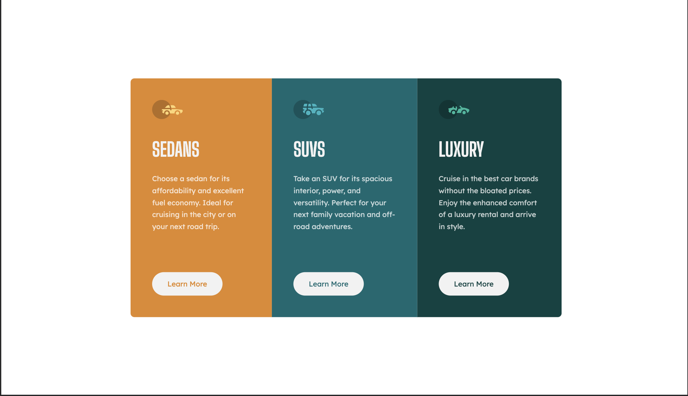

# Frontend Mentor - 3-column preview card component solution

## Table of contents

- [Overview](#overview)
- [The challenge](#the-challenge)
- [Screenshot](#screenshot)
- [Links](#links)
- [Built with](#built-with)
- [Author](#author)

## Overview

This is a solution to the [3-column preview card component challenge on Frontend Mentor](https://www.frontendmentor.io/challenges/3column-preview-card-component-pH92eAR2-)

### The challenge

Users should be able to:

- View the optimal layout depending on their device's screen size
- See hover states for interactive elements

### Screenshot

Mobile

Desktop

### Links

- Live Site URL: [Site](https://gfunk77-3-column-preview-card.netlify.app)
- github: [gfunk77](https://github.com/gfunk77/Frontend-Mentor/tree/main/3-column-preview-card)

### Built with

- html and css
- flexbox
- mobile-first workflow

## Author

- Frontend Mentor - [@gfunk77](https://www.frontendmentor.io/profile/gfunk77)
