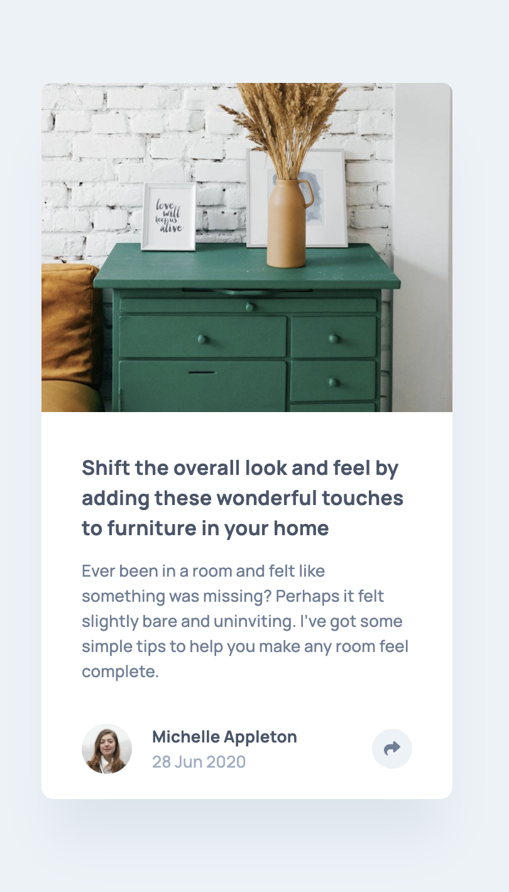
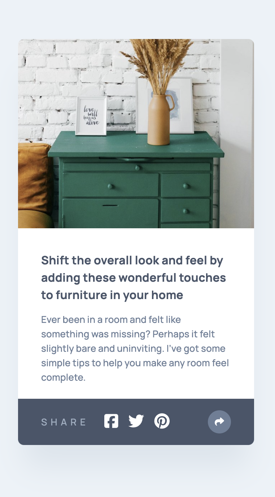
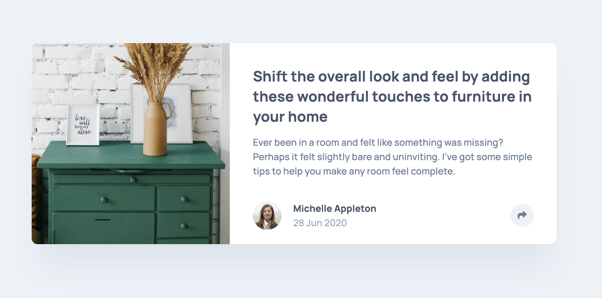
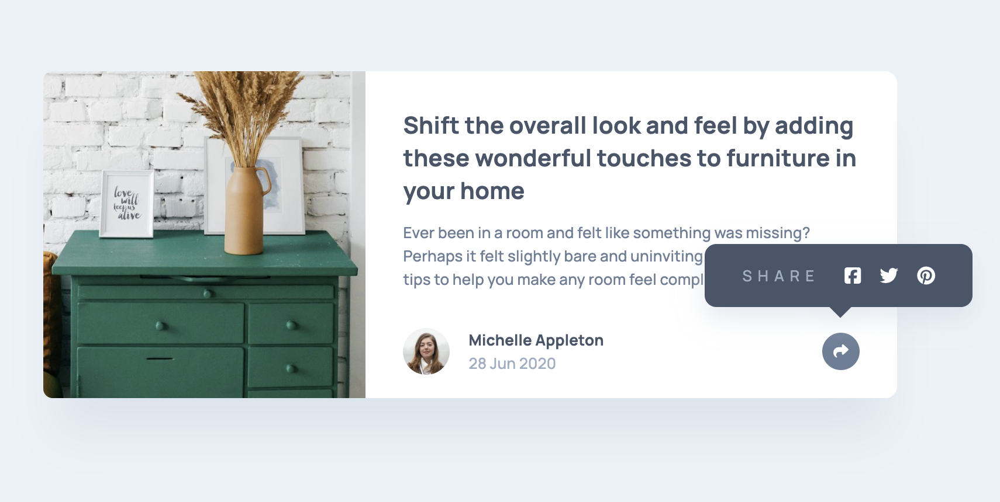

# Frontend Mentor - Article Preview Component solution

## Table of contents

- [Overview](#overview)
- [The challenge](#the-challenge)
- [Screenshot](#screenshot)
- [Links](#links)
- [Built with](#built-with)
- [Author](#author)

## Overview

This is a solution to the [Article Preview Component challenge on Frontend Mentor](https://www.frontendmentor.io/challenges/article-preview-component-dYBN_pYFT)

### The challenge

Users should be able to:

- View the optimal layout depending on their device's screen size
- See hover states for interactive elements

### Screenshot

Mobile

Mobile Active

Desktop

Desktop Active

### Links

- Solution URL: [Github](https://github.com/gfunk77/Frontend-Mentor/tree/main/article-preview)
- Live Site URL: [Netlify](https://gfunk77-article-preview.netlify.app)

### Built with

- html/scss/js

## Author

- Frontend Mentor - [@gfunk77](https://www.frontendmentor.io/profile/gfunk77)
