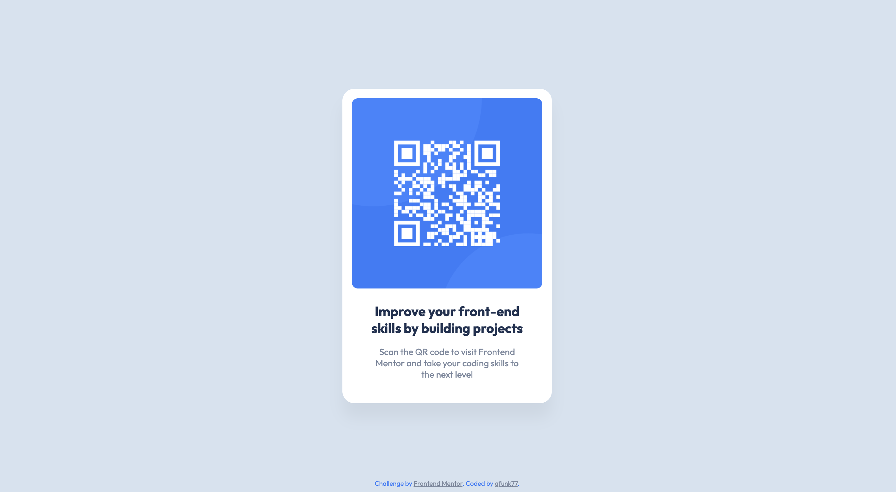

# Frontend Mentor - QR code component solution

## Table of contents

- [Overview](#overview)
- [Screenshot](#screenshot)
- [Links](#links)
- [Built with](#built-with)
- [Author](#author)

## Overview

This is a solution to the [QR code component challenge on Frontend Mentor](https://www.frontendmentor.io/challenges/qr-code-component-iux_sIO_H)

### Screenshot

Desktop

Mobile

### Links

- Gitbhub: [gfunk77](https://github.com/gfunk77/Frontend-Mentor/tree/main/qr-code-component-main)

### Built with

- html and css

## Author

- Frontend Mentor - [@gfunk77](https://www.frontendmentor.io/profile/gfunk77)
