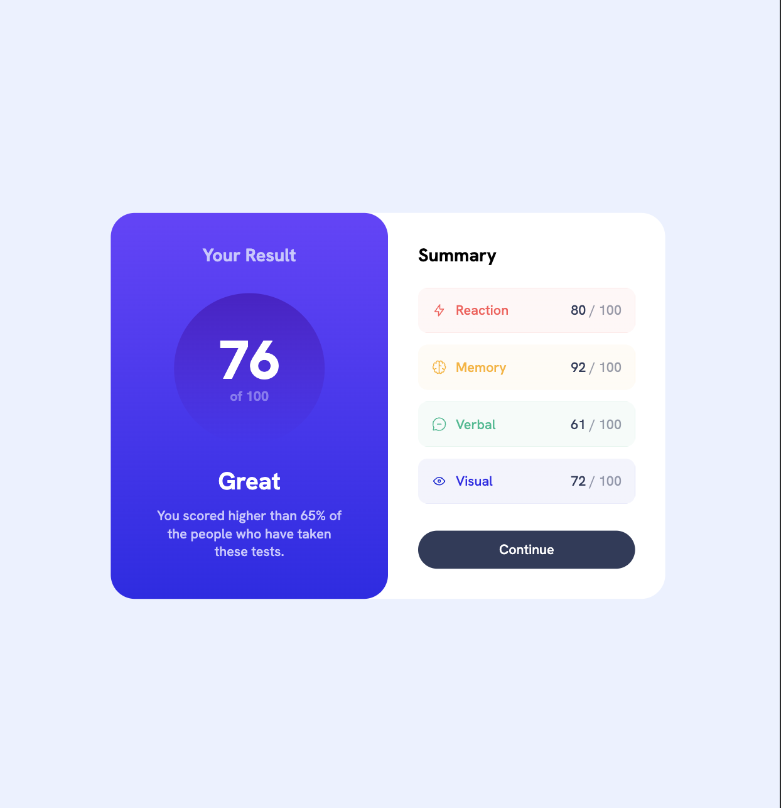

# Frontend Mentor - Results Summary solution

## Table of contents

- [Overview](#overview)
- [The challenge](#the-challenge)
- [Screenshot](#screenshot)
- [Links](#links)
- [Built with](#built-with)
- [Author](#author)

## Overview

This is a solution to the [Results Summary challenge on Frontend Mentor](https://www.frontendmentor.io/challenges/results-summary-component-CE_K6s0maV)

Initially I built this project with normal html markup. As I was adding in the JavaScript, I was just having fun removing more and more of the html. This final result does not represent best practices in JS. That wasn't my goal here.

### The challenge

Users should be able to:

- View the optimal layout depending on their device's screen size
- See hover states for interactive elements

### Screenshot

Mobile

Desktop

### Links

- Solution URL: [Github](https://github.com/gfunk77/Frontend-Mentor/tree/main/results-summary)
- Live Site URL: [Netlify](https://gfunk77-results-summary.netlify.app/)

### Built with

- css/html/js

## Author

- Frontend Mentor - [@gfunk77](https://www.frontendmentor.io/profile/gfunk77)
